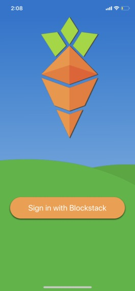
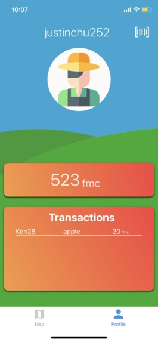
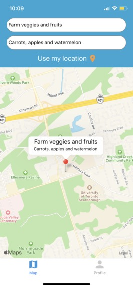

# Harvest

### Introduction and Inspiration
Harvest is a non-profit effort to address the severely flawed system of food production around the world. According to the Food and Agriculture Organisation of the United Nations, roughly one third of the food produced in the world for human consumption every year — approximately **1.3 billion tonnes** — goes uneaten. Furthermore, all of this food decomposing produces an enormous amount of methane gas, which traps thirty times more heat within the atmosphere than carbon dioxide. According to the World Wildlife Fund, the production of lost or wasted food generates the equivalent of **37 million cars'** worth of greenhouse gas emissions- and that’s only for the United States. 
Importantly; however, is that much of the product which goes to waste is completely safe to eat. So what happens to it? Simply, distributors only purchase items from producers which meet the standard to be sold- a multitude of commodities are simply misshapen, too small or large, or simply grown in a surplus and thus are put to waste instead of being sold.
Despite all this, over **800 million people** around the world live with food insecurity, and suffer from undernourishment and malnutrition. Even in Canada, which is ranked 8th in terms of lowest food insecurity, more than five hundred thousand adults and fifty thousand children experience hardship in acquiring adequate food. 
Stepping back, we see two separate issues: a surplus of wasted food contributing to global warming, and the widespread issue of individuals and families struggling to afford basic food needs. Harvest’s goal was to establish an accessible and efficient solution to these crucial issues. 

### How it Works:
When members sign up, they are given monthly in-app currency to exchange for foods. The items which they will receive are those which would not have normally made it to the grocery store shelf- these "Ugly" items would consist of misshapen, irregularly sized, or discoloured foods. These are perfectly edible, simply just not up to par with the grocery store's standards- perfect ingredients for stews, soups, and baked dishes. Although, what these products would lack it appearance they would make up for in cost, and thus would benefit low income or impoverished individuals. 

### How it was built:
Using a Blockstack decentralized app service, a permanent storage system was created for transactions and listing information. This lifted the burden of having a large centralized server. With React-Native, a UI was developed to display the information on the servers in a clean and efficient manner. 

### Who is it for?
Our app is focused on facilitating economic activity between two groups of people: producers in agriculture and lower income individuals. With this software, we strive to develop a symbiotic relationship to benefit all who use the app. In the case of farmers, previously wasted food, which would contribute to the globe’s increasing concern with food waste, can now be sold. In turn, families or individuals who are economically disadvantaged would gain the ability to purchase at a lower quality price for a very reasonable value. This would undoubtedly benefit the nutritional well-being of those people. 

### The Problems we faced:
1. U of T internet. 
2. The lack of documentation when attempting to use Blockstack in React Native. A large portion of time was spent figuring out how to work with such a system and thus the learning process was quite tedious.

### What’s next for Harvest?
Looking to the future, the expansion of Harvest out of the developed world and into more impoverished countries would be an amazing feat. In regions such as South East Asia, South America, and Africa, where poverty and hunger play a much larger role in society, the app could certainly benefit a multitude of people all while supporting local farmers and producers.
